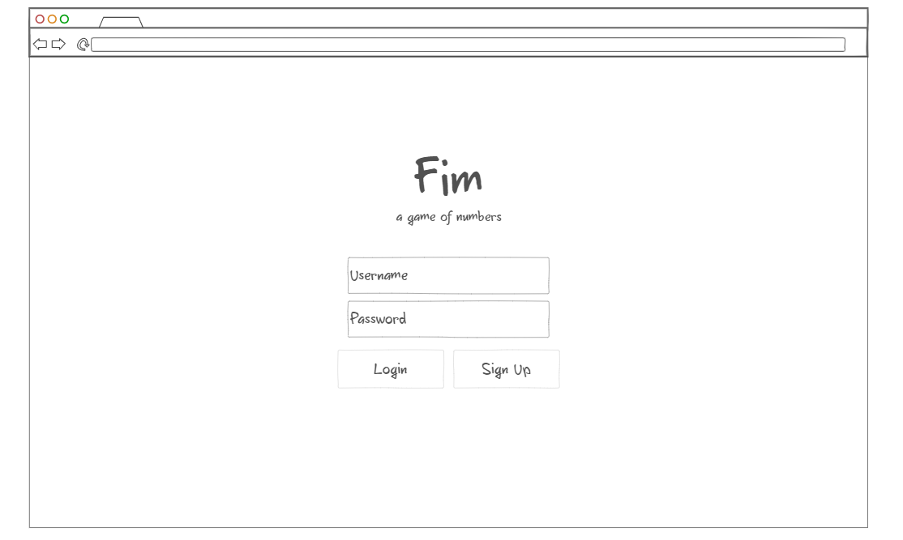
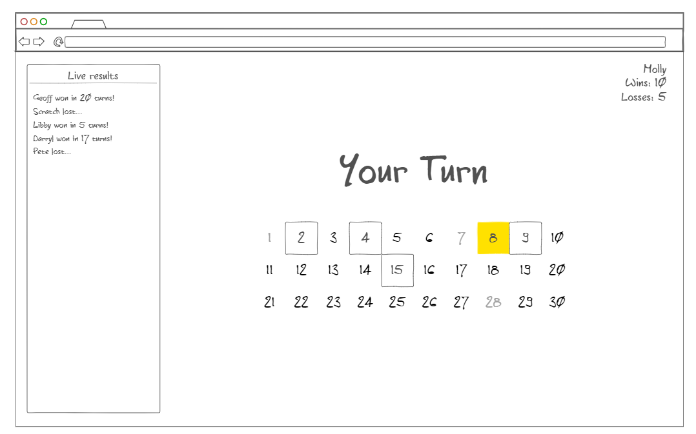

# Fim

## Description deliverable

### Elevator pitch

Games like Chess and Go have been around for centuries, but they lack one thing: simplicity. I present a game which is the solution. Fim is a pure strategy game that is very difficult to master, but it is easy to learn and each game takes only a few minutes. It's so simple, it could easily be played with pencil and paper! Each move consists of choosing a number, which is a simple click of a button on a computer interface. You can play a quick game with a friend, or practice your skills against a computer opponent.

### Design

### Key Features

- Secure login over HTTPS
- Choose game mode
  - Local 2-player play
  - Play against a computer algorithm
- Fim game
  - Display whose turn it is
  - Display grid of numbers, with buttons corresponding to possible moves
  - Take turn by clicking a valid number
- Wins and losses for each account persistently stored
- Live game results from other users

### Technologies

I am going to use the required technologies in the following ways.

- **HTML** - Used for application structure, with at least a login page and game page.
- **CSS** - Used for application style with a consistent color scheme, accomodating different device dimensions.
- **JavaScript** - Used for login and other endpoint calls, as well as the game logic and computer opponent algorithm.
- **Service** - Backend service with endpoints for:
  - login
  - retrieving win/loss numbers
  - submitting a game result
- **DB** - Securely store users and win/loss information in a database.
- **Login** - Register and login users. Services other than login accessible when authenticated. Display user information on game page.
- **WebSocket** - When a game is finished, a message is sent to all users indicating the user who finished the game, whether they won or lost, and the amount of turns if they won.
- **React** - Application ported to use the React web framework.

## HTML deliverable

For this deliverable, I have completed the overall structure of my application using HTML.

- **HTML pages** - There are 6 pages: login (index.html), home, mode select, 2-player setup, play, and how to play.
- **Links** - After logging in, you go to the home page, where there is a menu of options. From there you can go to mode select, how to play, or go back to login. In mode select, the first option takes you directly to the game page, and the second option takes you to 2-player setup first. All pages except login and home have a link in the header to go to home.
- **Text** - The game is made up of a grid of numbers, the how-to-play page contains the rules for the game, and other pages have simple instructions.
- **Images** - I made a `favicon.ico` for the website icon, and a `logo.png` which is used for a logo in the header.
- **Authentication** - The login page has a form with username and password and two buttons, which will be used for sign up / login. When logged in, the home page shows the user's name, with "Molly" as placeholder.
- **Database** - On the play page, there is a section with the user's name and their amount of wins and losses. This information will be stored in a row of a database, so that it is saved even when the user logs out.
- **WebSocket** - On the play page, there is a section that will display live game results, which will be sent to the server and then received by everyone when a game finishes.
- **3rd-Party Service** - There is a placeholder for a random quote on the how-to-play page.

## CSS deliverable

For this deliverable, I added style and formatting to my application using CSS.

- **Header, footer, and main content body** - Most content is centered, and the header and footer have a darker color. I should note that there is no header in index.html, and this is intentional.
- **Navigation elements** - Navigation between pages is done with buttons styled with Bootstrap in the body. The only navigation in the header is the logo, which is a link to home.html. This kind of navigation is different than traditional webpage navigation, but it is common in many games.
- **Responsive to window resizing** - There are responsive header and footer on all pages. On the play page, the size of the number grid is responsive, and the live results will move to the bottom if the window gets too narrow.
- **Application elements** - Content is generally center-aligned and justified. The live results in the game page are shown on the side (or beneath). For the overall style I went for a sort of dark blue-indigo theme with light elements. The game board is a purple grid, with cells styled according to the current state for each number.
- **Application text content** - Most text is white to stand out against the dark background. Headings have a subtle glow. Player names are coloured cyan, and the number of wins/losses has color as well. The quote uses a Bootstrap-style info box.
- **Application images** - There was not too much change needed here, but the Fim logo is center-aligned, and I added a glow behind the large version on the login-page.

## JavaScript deliverable

For this deliverable, I completed the game's core functionality and manipulated the DOM for more dynamic content using JavaScript.

- **Login** - When the login or sign up button is pressed, the text in the username field is saved to localStorage and displayed on the home page and play page. If no username is entered, "Guest" is used instead.
- **Database** - On the play page, an object representing a database is retrieved. When a game is won or lost, the corresponding variable is incremented, the database object is updated, and the data is saved back to localStorage. Each row in the database is simply a username, a wins number, and a losses number. When the page is first loaded, and after every update, the numbers in the top-left are filled with the appropriate values. Guest data is saved for the session but not saved to the database.
- **WebSocket** - The Live Results on the play page generates random messages which represent the messages coming in from the WebSocket.
- **Application Logic** - The game works as intended for one or two human players. In one-player mode, an algorithm is run in a web worker to determine the CPU's move. When the game ends, a message is displayed saying who won, and there are options to play again or return to the home page. In-two player mode, both players take turns using the local device. The DOM is manipulated to update the game state. The rules for the game can be found on the how-to-play page.

## Service deliverable

For this deliverable, I created endpoints on the backend using Express and called endpoints on the frontend.

- **HTTP service with Node.js and Express** - The `index.js` file uses the Express package installed with npm.
- **Frontend served using Express static middleware** - The `public` directory contains the frontend files, which are served using the line `app.use(express.static('public'));`.
- **Frontend calls 3rd party service endpoints** - A random quote is obtained with a `fetch` command and placed in the how-to-play page.
- **Backend provides service endpoints** - There are api endpoints in the backend for getting a user's current wins/losses and notifying the server of a win or loss.
- **Frontend calls service endpoints** - When the game page is loaded, the wins and losses are initialized from a GET request to the server, and when the user wins or loses, a PUT request is sent to the server to make the corresponding change. When the server is unavailable, localStorage is used.

## Database deliverable

For this deliverable, I configured the backend to interact with a MongoDB database to store needed data.

- **MongoDB Atlas database created** - Done
- **Backend endpoints for manipulating application data** - This is done similarly to the service deliverable, except now the endpoints work by interacting with the database.
- **Stores application data in MongoDB** - There is a userStats collection in MongoDB that stores objects containing a username, number of wins, and number of losses.

## Login deliverable

For this deliverable, I added the ability to log in to the application with credentials that are securely stored in a database.

- **Supports new user registration** - The Sign Up button registers a new user.
- **Supports existing user authentication** - The Log In button authenticates an existing user.
- **Stores and retrieves credentials in MongoDB** - The server encrypts the password and stores credentials in a user collection, and data can be retrieved from the userData collection.
- **Restricts functionality based upon authentication** - User data can only be requested by authenticated users, and users can only modify their own data. A user cannot tell the server to record a win or loss for a different user.

## WebSocket deliverable

For this deliverable, I added a WebSocket to both the client and server and completed the Live Results functionality.

- **Backend listens for WebSocket connection** - This is done using the ws package.
- **Frontend makes WebSocket connection** - This is done with the WebSocket class.
- **Data sent over WebSocket connection** - When the client finishes a game, it sends a message to the server, and then the server sends the data to all connected clients.
- **WebSocket data displayed in the application interface** - When a cilent receives a message, it adds a new message to the Live Results interface.

# Notes for exams
[Notes](notes.md)
